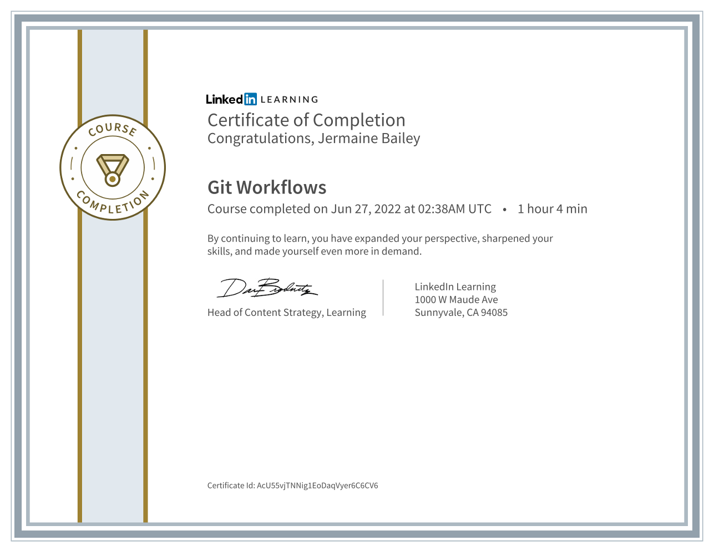
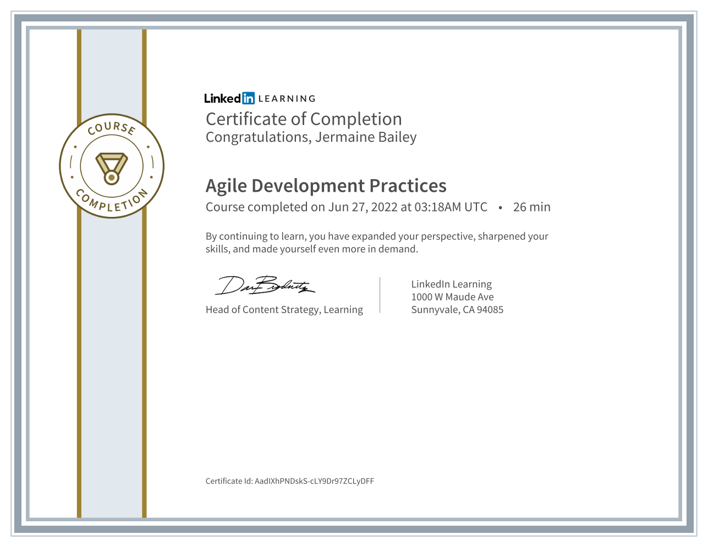
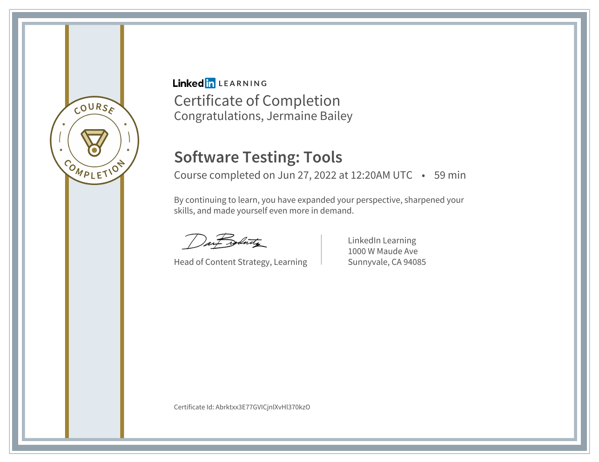
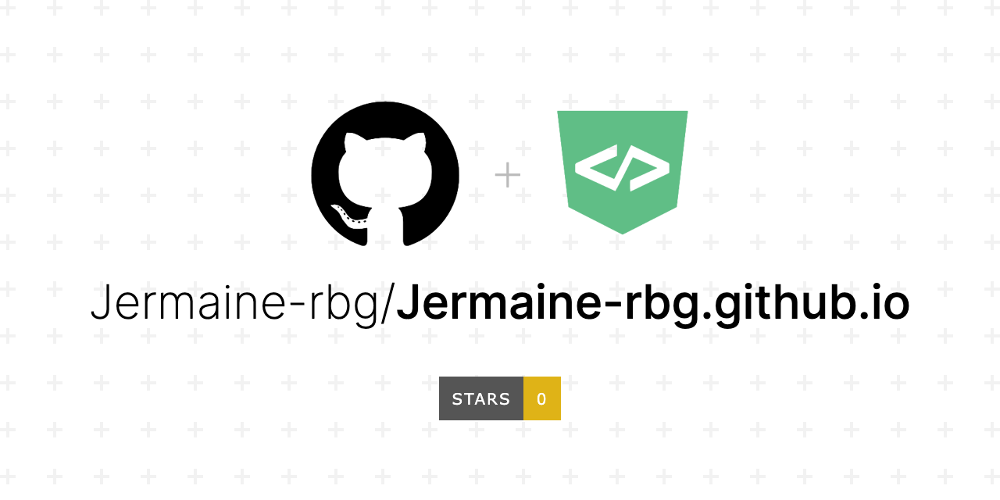

<h1>Recent LinkedIn Courses</h1>

 

<iframe width="640" height="360" src="https://www.linkedin.com/learning/embed/git-workflows/development-workflow-with-git-flow?autoplay=false&claim=AQHyen3te7zTegAAAYGiwayQWqZ4QkjhmHcII_DYNhYkFhAey_Y7p3h4MysQdpxJcJVY_OcS_XicnnIPbanaBsY_JLnWeENLd-rJS1UYv0HV7IEc2ZGwxIvCsBKkY2VjtdmxzpYd4bO0CjglPP2XNOhy8CzS_xPVUyMrFpC77KGFiDXahX29gX1mj23wockBqSupzX4KG4vQosr5Zt9tj4hln_vnhCOChcixXTwrEruM1xBImmNEurJLxi1jXiLrX75Ry85BTb08QqvhxqPKExvWUtg3eXb6F8HyhJeqDYN1M8LKGCAX1zLxs6y2KfLgZDUd6AnczmBBkF-LOroTTqeEW8SJbJrdO9wqq_F9DErXJ1qGeKzdz9-nRiwex2xcgW95Vsun-_lP-TwR5R-5taHFqG7-G2JP825GsYHTuV_tY_eTY_6BMwI67V5w4qzR4uQf6fuzCDWMqllt8K9_X8d9kAgitBZJFZWnF9r5-25b2hBkPnVb3vzNcDBMprDzjmUs4sj1RTme-pAjsdaR1hlwcRH7V5XC2I-tmuhywazJoWLWOj6oj5m-yHwhvoMIPSnXqXO61-7LrF3w0yJwEL0cGll1J08iJYqhYsj7ZWl94Tgu4cORBb95X4ERCLuHUZDc9uS5PzZLZFJfvsj4dP8fOGxQ1EWtGD7J4DNsN4nWyW5kQWLPq0T7FOtpw6jTPf534UkBACVz_oiCNNVNNhhZTZwHos5MyYbGLjROuF-fZFhGoxlB3e_Gjkt-ElmgAwvjVa6-AwOSNsKSe3LiEOSPByWxIMIBdInfBLnI67XRWJvr7KoBNLrILKBIThJCSWSS4kC5vxsS9xjw0SU3pkktM6N8bhIQ33fVUbnkkaILl_Jw77TNpSfgl8V_ptdaVjd7Ce5UZsd92s86mL4SU8UVM4dcFI9LGcx1BNpz1QtBU-5fnK1uBMZEEeJPk63ZJnf5fagMfYI3y8w96DBSxN-7ZIK6HDevzRKhcKJM0IPu8J_Kr-smOUiDEelUhxb7YYzhIVM6A0IJKrv8rxIc00BluJdDhgkTAqrb1H77xC5i3dW0O6CDQBcD73-LVFNjVKauq3x-xdtkAaCxmLxpFIhcFAIVtPi8Do6_QLy_RK12utCFgxb-VhF3KeqgUazBZPr7vD37ej_E1g2xOwtaxVPIVc5ucjef71Ma&lipi=urn%3Ali%3Apage%3Ad_learning_content%3BRC%2FN4pFHQQ%2B7EFlQdifrPg%3D%3D&licu" mozallowfullscreen="true" webkitallowfullscreen="true" allowfullscreen="true" frameborder="0" style="position:absolute;width:100%;height:100%;left:0"></iframe>

<strong><a href="https://www.linkedin.com/learning/git-workflows/development-workflow-with-git-flow?trk=embed_lil">Development workflow with Git flow</a></strong> from <strong><a href="https://www.linkedin.com/learning/git-workflows?trk=embed_lil">Git Workflows</a></strong> by <strong><a href="https://www.linkedin.com/learning/instructors/kevin-bowersox?trk=embed_lil">Kevin Bowersox</a></strong>

<h3>Skills learned in this course.</h3>

<ul>
<li>What is Git Flow</li>
<li>What is GitHub Flow</li>
<li>GitHub Flow Repo setup</li>
<li>Branch Structure</li>
<li>Truck Based Development</li>
<li>Using GitHub Pages and Actions</li>
<li>Feature Flags</li>
<li>Using feature flag software</li>
<li>Releasing with feature flags</li>
</ul>

 
 

<iframe width="640" height="360" src="https://www.linkedin.com/learning/embed/agile-development-practices/taking-your-agile-development-capabilities-to-the-next-level?autoplay=false&claim=AQHtMt9smpoQJAAAAYGjW2FvZVRsfgojnUDo8ygEYmUW-JciQLewn_6P90hH5bSofvharyCjbcM4X0ZSj5kZGSBCoAhEpACZYFCoceEbjtKCKwjyCtCAG2YdVmKpHiu9IeR-s1taV7VCpPjMODQ5W3PK_7y1bHjVmeb0AG-AxAqXhBeB5hwIqMRYSOIL5EOQ-71iisL3C5jZ2sXioT5uwIujLJVdKpTr0o9TdgZ0EyTM20ilP2hWM5j0zzCZ-qhFjxJPN0k9XVnjJL98jijZ5sqApIAZA4v0HfQzbhJGflMfUbgeVE5JcqfUAAr9ulb_HD0wqs0xPe63FONWFjVDBrkPyGCsuSTW8h8kHofH0VrJaV3UDLxw6i2XMG2gNjNzYeYPK2jUQoGTnrWIWvOLBemVFuuZphVzcuuK39mZiSxdDeacd8218xC98tWK5PTqJXGsDpRVkPG28xjPrabRKA57e-lNoMr7kI10rrhhjCecinrOl35tHPDQlhYxFIweX_J2P945FAfDb0L4UCtN5fkwv4EA8tpdrTmaPRgHYW78CpN2dVs6NFXJ_E4OAWo0Fa8oCKhEUihkgZLOgqL3vlRlz3HOIJe6juGxJwpCW_ZetsI3Hefn8dtjAH9rUXtA1RQTg7RKbO9B7_c6hyUBQ5ZgYiEc242uWFAqjJ0CgYmDy9UIIhy0kWmC8xH4S4RhaPoRlC2zAVKnOfMGcPqkp26g5p17K4EyXg0ft22Em80Wh8MVmuynb6ikpq40TDPoKf_j9B5ayGUKObXGvdqZyrJPmxoWKBhascCGxuFffwWqTxtTgsO2HT_LxEFJVwY1BSOo6aVlJZmVobF8d8SVHSGd_-nhJNaQzrAE21Qw6fD5v3cUGkb0NJKzC_Zmo2mjoCTpwR4ajkTAZ9N5QVayzj8VMcylqXRCvJdQsSsj4cBbmHFiTuCcG9q7Y_A5ZbJeo8urp14DNKFMHHcE7XNaKXji9_oFowdfGAvbkMPVC9djmK_qSeYIOG5USlpPdjfEXy1FOaGcP8kdMl6SV64uYBOrSC7qwJ30PVcEkJwPizmbj4t0_k_-7BvJDOPVyIl2edsgDbNKrz7HrvGURTM7_3tpRlE0pCRAYTd4qusmrs4tJIxE_ijeSk0qXiWH3o23iPMt3kmN_LzWVi2EGXmV_uHKLoeMoSo&lipi=urn%3Ali%3Apage%3Ad_learning_content%3BbtxeWXRnRV6OiYjcP5XgpQ%3D%3D&licu" mozallowfullscreen="true" webkitallowfullscreen="true" allowfullscreen="true" frameborder="0" style="position:absolute;width:100%;height:100%;left:0"></iframe>

<strong><a href="https://www.linkedin.com/learning/agile-development-practices/taking-your-agile-development-capabilities-to-the-next-level?trk=embed_lil">Taking your agile development capabilities to the next level</a></strong> from <strong><a href="https://www.linkedin.com/learning/agile-development-practices?trk=embed_lil">Agile Development Practices</a></strong> by <strong><a href="https://www.linkedin.com/learning/instructors/harrison-ferrone?trk=embed_lil">Harrison Ferrone</a></strong>

<h3>Skills learned in this course.</h3>

<ul>
<li>Planning and design</li>
<li>Developing flexible architecture</li>
<li>Documentation considerations</li>
<li>When to optimize</li>
<li>Determining velocity</li>
<li>Agile programming techniques</li>
<li>Refactoring</li>
<li>Testing and handling bugs</li>
<li>Testing and handling bugs</li>
</ul>

 
 

<iframe width="640" height="360" src="https://www.linkedin.com/learning/embed/software-testing-tools/making-the-right-software-testing-choice?autoplay=false&claim=AQFc7YpP7NScJwAAAYGjvScEWBCgCCu_ic9VD1KFnnX-dWWUTfnxwz_zosZsdCLPp_aRkwYLE5HboyWCUr40_NUnajTy0FZdHb4t7Oyf9lnakas0Cb8b9WAJX_0uaSUV7hYNFrExfaYvWs6_PSURU_ACb-LWpN5_SW8R49g91OY1_FzkwNy0jJI5juq9BVpxrXReYrjVFcOpmLUITC94IWnX4I8mJ8S5VbvO8v5aiNl2R-GRA6UuhwkkL0NPYVG3Nig9KTex_G41YuTSkZLTCPjfDK8JdxGPBGIn6CGb0rM3P9GJKN-mByFbjH3R5Vxl4Az9hOngj3qcTkdQldDnFzEoKuzwoqPZz0hItRhf5utV2lI7oMK6qRk7HUS5pOaaxrkxTCNNWdGEwli9YoLiKa6KuUh8l8ZeYHilaYidHlMy5jYyvLelXJfXb3TCqSp7ftdtiC_bGuRy6HUDHA0TKAPI0hCkDCE279Q67KoZZpJbbTxE45hwsk_Ntu8PcaeufS6Rfy2gC2PaHv3CdNnKP3_jWUoD1UETMnpdRoHHtJNnKsuwy0zMajS2Sk8AEMbnOzqsSYEe9sRcy2hBv5pNimxuWTaiCxlgoPHEG5RDLfGH58bJgw_umr8okXq_JpJZC21Yy9RPmaDdfyNiJLVWnKoj6hx1EFUzYWoGn1WjVlPK7sjw7zxJGSkGixccduyJbih0PT40S5AmRnJtCW1YHIAfP2S3bIAIOEI2ACDl_wwMGQ0OuBIkZIB372HZv4NfTTmvIIICtNkKuYLrkVoNWwWeZEW7wIcFmY2M4AFf1tfWQFUnBiGxthtqsZQvrs8RjLJicqHLTgje3dkT2eKxxVb3j_gd6ch0_Ab9IeLuJQTBhtd5Mrm8hm7C7TbQ21Cme8gi2e76H3mlpDbJAM0L7lYY20TGWGcDdKj7Htl8VGEGjF59sWS0qTY4P4K84k7f8lXsDRjoSosIjYhn5TpQm_HPBEaBbCFhp7yXBlS8FTGqsM3ievUAvwPi01DnArvo5j072bmZbK6yhAkes_cFBQ2QF40uNtSRzGEWLBVFjhZU6LOMG0ROEggE9pdamzcNoNTWveJVRKBzQlq9DYmAAx8yRVcnjXvGbNEHxjAMeqoYZlEF5OX9VyvwcqEx-32yeLMbYQTOB8E6Z3iV-ME6G8xdr8ljixe_PPNa&lipi=urn%3Ali%3Apage%3Ad_learning_content%3BvpUTI2PtQHWM%2BtUbjqWYEQ%3D%3D&licu" mozallowfullscreen="true" webkitallowfullscreen="true" allowfullscreen="true" frameborder="0" style="position:absolute;width:100%;height:100%;left:0"></iframe>

<strong><a href="https://www.linkedin.com/learning/software-testing-tools/making-the-right-software-testing-choice?trk=embed_lil">Making the right software testing choice</a></strong> from <strong><a href="https://www.linkedin.com/learning/software-testing-tools?trk=embed_lil">Software Testing: Tools</a></strong> by <strong><a href="https://www.linkedin.com/learning/instructors/michael-smith-2?trk=embed_lil">Michael Smith</a></strong>

<h3>Skills learned in this course.</h3>

<ul>
<li>Lifecycle management</li>
<li>Test planning tools</li>
<li>Test automation frameworks</li>
<li>API testing tools</li>
<li>Vulnerability scanners</li>
<li>Load testing with JMeter and more</li>
<li>Beyond QA: Unit testing and infrastructure testing</li>
</ul>

 
 

<h3>GitHub Account</h3>

 

 

